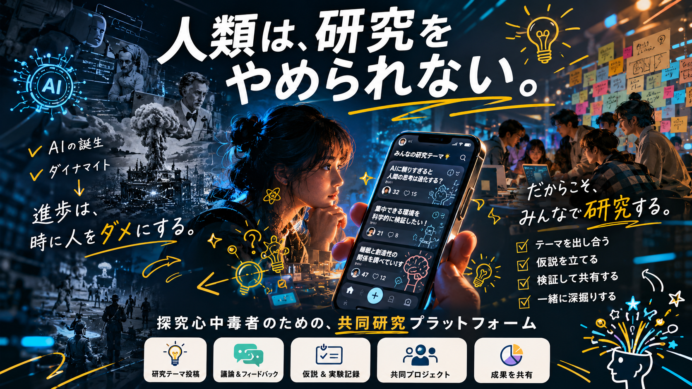

<div align="center">



# Pandora

### 探究心中毒者のための、共同研究プラットフォーム

</div>

---

## 人類は、研究をやめられない。

AI の誕生も、ダイナマイトも——**進歩は、時に人をダメにする。**
それでも人間は、気になったことを試さずにいられない。

**だからこそ、みんなで研究する。**

- 🧪 テーマを出し合う
- 💡 仮説を立てる
- 📊 検証して共有する
- 🔥 一緒に深掘りする

Pandora は、この「探究依存」を設計に組み込んだ Web プラットフォームです。

---

## 主要機能（MVP）

| アイコン | 機能 | 概要 |
|:---:|------|------|
| 🔬 | **研究テーマ投稿** | 気になる題材（眉毛ワセリン・目の体操…）を投稿。AI が確からしさを Web/論文ベースで要約 |
| 💬 | **議論 & フィードバック** | 同じ題材に取り組む人と記録を比較し、コメント・リアクションで深掘り |
| 📝 | **仮説 & 実験記録** | AI が日次チェック項目（数値/セレクト/画像/スライダー/テキスト）を自動生成。記録するだけで"ちゃんとした実験"に |
| 👥 | **共同プロジェクト** | 同題材ユーザーは自動でグループ化。n=1 の個人実験が n=100 の集合知になる |
| 🎉 | **成果を共有** | 一定期間試して「確からしい」と感じた結果を世界に公開。次の沼の入口になる |

---

## 技術スタック

| レイヤー | 技術 |
|----------|------|
| フロントエンド | Next.js 14+ (App Router) / TypeScript / React Server Components |
| UI | Tailwind CSS + shadcn/ui |
| ホスティング | Vercel |
| API | Next.js Route Handlers（API Gateway / Lambda は使わない） |
| 認証 | AWS Cognito（メール+パスワード） |
| データベース | Amazon DynamoDB（シングルテーブル設計） |
| ストレージ | Amazon S3 + CloudFront |
| AI / LLM | AWS Bedrock（Claude モデル） |
| IaC | AWS CDK (TypeScript) |
| CI/CD | GitHub Actions |

---

## アーキテクチャ概要

モノレポ構成・2 ユニット:

- **U1: Web App** (`/`) — Next.js アプリ本体。`features/<domain>/` でドメイン別に Service / Repository / Adapter を配置。Vercel にデプロイ
- **U2: AWS Infra** (`/infra/`) — Cognito / DynamoDB / S3 / IAM を CDK でプロビジョン。出力値は Vercel 環境変数経由で U1 に渡す

```
pandora/
├── app/              # Pages + API Route Handlers
├── components/       # 共通 UI 部品
├── features/         # auth / research / daily-record / group / ai
├── lib/              # AWS clients, JWT verifier, etc.
├── middleware.ts     # 認証ミドルウェア
└── infra/            # AWS CDK
```

---

## 開発ステータス

AI-DLC（AI-Driven Lifecycle）ワークフローで進行中。詳細は `aidlc-docs/` を参照。

- [x] Inception Phase（要件定義・ユーザーストーリー・アプリケーション設計・Unit 分割）
- [ ] Construction Phase（機能設計・NFR 設計・コード生成・Build & Test）
- [ ] Operations Phase

## ドキュメント

- [サービス企画書](./idea.md)
- [要件定義](./aidlc-docs/inception/requirements/requirements.md)
- [ユーザーストーリー](./aidlc-docs/inception/user-stories/stories.md)
- [アプリケーション設計](./aidlc-docs/inception/application-design/application-design.md)
- [Unit of Work](./aidlc-docs/inception/application-design/unit-of-work.md)
