# Execution Plan — Pandora

**作成日**: 2026-05-07
**プロジェクトタイプ**: Greenfield（MVP / Web）

---

## 1. Detailed Analysis Summary

### 1.1 Change Impact Assessment

| 観点 | 影響 | 内容 |
|------|------|------|
| User-facing changes | **Yes** | 全機能が新規ユーザー向けUI/UX |
| Structural changes | **Yes** | フルスタック新規構築（FE+API+データ+AI+ストレージ） |
| Data model changes | **Yes** | User / Research / DailyRecord / Comment / Reaction 等を新規設計 |
| API changes | **Yes** | Next.js Route Handlers として新規 API |
| NFR impact | **Yes** | パフォーマンス・認証・ストレージ・AI コール・小規模スケール |

### 1.2 Risk Assessment

- **Risk Level**: **Medium**
  - 新規構築だが規模は MVP / 想定ユーザー数は数人
  - 不確実性は AI（Bedrock 応答時間と品質）と Vercel↔AWS 認証連携
- **Rollback Complexity**: Easy（プロトタイプ。デプロイ単位で切り戻し可能）
- **Testing Complexity**: Simple〜Moderate（軽量な単体・統合テスト中心）

### 1.3 関連コンポーネント（暫定マッピング）

```
[Vercel: Next.js App]
  ├─ Public Pages (タイムライン / 詳細)            ← E4
  ├─ Authed Pages (ホーム / マイ研究 / グループ)   ← E1, E2, E3, E5
  └─ Route Handlers /api/*
      ├─ Research API (CRUD + AI生成)              ← E2, E6
      ├─ DailyRecord API (CRUD + 画像)             ← E3
      ├─ Group API (一覧/コメント/リアクション)     ← E5
      └─ Auth Bridge (Cognito JWT verify)          ← E1

[AWS]
  ├─ Cognito (User Pool)                           ← E1
  ├─ DynamoDB (主要永続化)                          ← E2-E5
  ├─ S3 (画像)                                     ← E3
  └─ Bedrock (Claude モデル)                       ← E6
```

---

## 2. Workflow Visualization

```mermaid
flowchart TD
    Start(["User Request"])

    subgraph INCEPTION["🔵 INCEPTION PHASE"]
        WD["Workspace Detection<br/><b>COMPLETED</b>"]
        RA["Requirements Analysis<br/><b>COMPLETED</b>"]
        US["User Stories<br/><b>COMPLETED</b>"]
        WP["Workflow Planning<br/><b>COMPLETED</b>"]
        AD["Application Design<br/><b>COMPLETED</b>"]
        UG["Units Generation<br/><b>COMPLETED</b>"]
    end

    subgraph CONSTRUCTION["🟢 CONSTRUCTION PHASE"]
        FD["Functional Design<br/><b>NEXT</b>"]
        NFRA["NFR Requirements<br/><b>EXECUTE</b>"]
        NFRD["NFR Design<br/><b>EXECUTE</b>"]
        ID["Infrastructure Design<br/><b>EXECUTE</b>"]
        CG["Code Generation<br/>(Planning + Generation)<br/><b>EXECUTE</b>"]
        BT["Build and Test<br/><b>EXECUTE</b>"]
    end

    subgraph OPERATIONS["🟡 OPERATIONS PHASE"]
        OPS["Operations<br/><b>PLACEHOLDER</b>"]
    end

    Start --> WD
    WD --> RA
    RA --> US
    US --> WP
    WP --> AD
    AD --> UG
    UG --> FD
    FD --> NFRA
    NFRA --> NFRD
    NFRD --> ID
    ID --> CG
    CG --> BT
    BT --> OPS
    OPS --> End(["Complete"])

    style WD fill:#4CAF50,stroke:#1B5E20,stroke-width:3px,color:#fff
    style RA fill:#4CAF50,stroke:#1B5E20,stroke-width:3px,color:#fff
    style US fill:#4CAF50,stroke:#1B5E20,stroke-width:3px,color:#fff
    style WP fill:#4CAF50,stroke:#1B5E20,stroke-width:3px,color:#fff
    style AD fill:#4CAF50,stroke:#1B5E20,stroke-width:3px,color:#fff
    style UG fill:#4CAF50,stroke:#1B5E20,stroke-width:3px,color:#fff
    style FD fill:#FFA726,stroke:#E65100,stroke-width:3px,color:#000
    style NFRA fill:#FFA726,stroke:#E65100,stroke-width:3px,stroke-dasharray: 5 5,color:#000
    style NFRD fill:#FFA726,stroke:#E65100,stroke-width:3px,stroke-dasharray: 5 5,color:#000
    style ID fill:#FFA726,stroke:#E65100,stroke-width:3px,stroke-dasharray: 5 5,color:#000
    style CG fill:#4CAF50,stroke:#1B5E20,stroke-width:3px,color:#fff
    style BT fill:#4CAF50,stroke:#1B5E20,stroke-width:3px,color:#fff
    style OPS fill:#BDBDBD,stroke:#424242,stroke-width:2px,stroke-dasharray: 5 5,color:#000
    style Start fill:#CE93D8,stroke:#6A1B9A,stroke-width:3px,color:#000
    style End fill:#CE93D8,stroke:#6A1B9A,stroke-width:3px,color:#000

    linkStyle default stroke:#333,stroke-width:2px
```



---

## 3. Phases to Execute

### 🔵 INCEPTION PHASE

- [x] Workspace Detection — **COMPLETED**
- [x] Reverse Engineering — **SKIPPED**（Greenfield）
- [x] Requirements Analysis — **COMPLETED**
- [x] User Stories — **COMPLETED**
- [x] Workflow Planning — **COMPLETED**
- [x] **Application Design** — **COMPLETED**
- [x] **Units Generation** — **COMPLETED**
  - **Units**:
    - **Unit 1: Web App** — Next.js（UI + Route Handlers）
    - **Unit 2: AWS Infra** — CDK（Cognito / DynamoDB / S3 / Bedrock 設定 / IAM）

### 🟢 CONSTRUCTION PHASE（各ユニットでループ）

- [ ] **Functional Design** — **EXECUTE**
  - **Rationale**: User / Research / DailyRecord / Comment / Reaction のデータモデルと、AI 生成フローのロジックを設計する必要がある。
- [ ] **NFR Requirements** — **EXECUTE**（軽量）
  - **Rationale**: AI 応答 30 秒、画像最大サイズ、認証セッション、レスポンシブなど MVP でも明示が必要。
- [ ] **NFR Design** — **EXECUTE**（軽量）
  - **Rationale**: NFR Requirements が出るので最低限の対応設計が必要（タイムアウト、IAM ロール、S3 ポリシー等）。Security Baseline 拡張は OFF だが、最低ラインは押さえる。
- [ ] **Infrastructure Design** — **EXECUTE**
  - **Rationale**: AWS リソースの構成（Cognito / DynamoDB スキーマ / S3 バケット / Bedrock 呼び出しモデル / Vercel⇄AWS 認証）を設計しないとコードが書けない。CDK 構成も決定する。
- [ ] **Code Generation** — **EXECUTE**（ALWAYS）
- [ ] **Build and Test** — **EXECUTE**（ALWAYS）

### 🟡 OPERATIONS PHASE

- [ ] Operations — **PLACEHOLDER**
  - **Rationale**: 現状はプレースホルダー。MVP では Build & Test 完了をもって完成とする。

---

## 4. Skipped Stages

| ステージ | 理由 |
|---------|------|
| Reverse Engineering | Greenfield（既存コードなし） |
| Operations | プレースホルダー扱い。MVP の対象外 |

なし以外で **EXECUTE** とした条件付きステージは、いずれも MVP 範囲でも価値があると判断（特に Application Design / Infrastructure Design は AWS 統合のために必須）。

---

## 5. Estimated Timeline

- **総ステージ数**: 11（Inception 6 + Construction 6 + Operations 1）
- **想定期間**: **約 1 週間**
  - Day 1: Application Design + Units Generation
  - Day 2: Functional Design + NFR
  - Day 2-3: Infrastructure Design + 初期 IaC
  - Day 3-6: Code Generation（Unit 1: Web App / Unit 2: Infra）
  - Day 6-7: Build and Test + デモ準備

---

## 6. Success Criteria

- **Primary Goal**: Pandora MVP（idea.md / requirements.md / stories.md に準拠）の Web 版を 1 週間で動作可能な状態にする
- **Key Deliverables**:
  - Vercel にデプロイされた Next.js アプリ
  - AWS（Cognito/DynamoDB/S3/Bedrock）のリソース一式（CDK 管理）
  - 13 本の User Story の Must（10 本）すべて満たす
  - 軽量な単体・統合テスト
- **Quality Gates**:
  - すべての Must ストーリーで AC が満たされる
  - AI 生成（題材→実験設計）が 30 秒以内
  - レスポンシブ動作（PC/スマホ）
  - 認証必須エンドポイントが未認証で 401 を返す
- **Out of Scope**（再掲）: 通知 / フォロー / 削除/非公開 / 多言語 / 課金 / モデレーション
